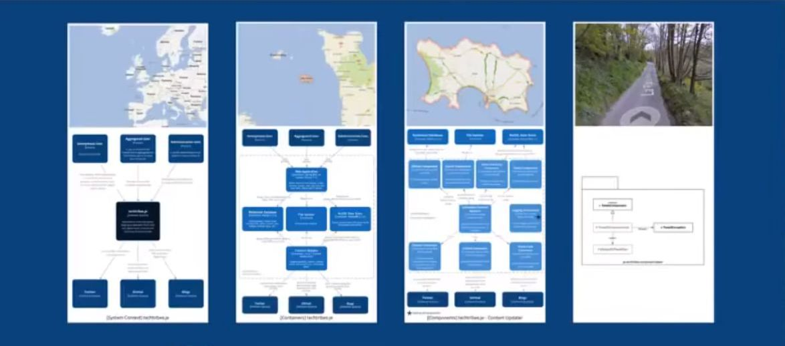

"Software Architecture" is just a fancy way of saying "how code is organised" and/or how "data flows" through a system. Whenever you see the word "pattern" it just means "a bunch of experienced people have concluded that this works well, so as beginners, we don't have to think too hard (up-front)."

# C4 Model

[Source](https://www.youtube.com/watch?v=1zYK615kepE)

The model prevents unstandardized drawings of architectures due to the lack of common vocabulary. A common set of abstractions is more important than a common notation i.e. **"Abstraction first, notation second"**.

Very often the code does not match the architecture diagrams. The diagrams are maps that help developers navigate a large and complex codebase.

## Abstraction

A **software system** is made up of one or more **containers**, each of which contains one or more **components**, which in turn are implemented by one or more **code elements**. It's basically zooming in or out.

- Context of the System
- Containers
- Components
- Code

#### Example

- **[Context]** Customer uses CRM
    - **[Container]** Front End - Single Page App
        - **[Component]** Login component
        - **[Component]** Leads component
            - **[Code]** HTML
            - **[Code]** CSS
            - **[Code]** Javascript functions
    - **[Container]** Back End - RESTful API
        - **[Component]** Login endpoints
        - **[Component]** Leads endpoints
            - **[Code]** GET api/leads
            - **[Code]** GET api/lead/1
            - **[Code]** POST api/leads
    - **[Container]** Database
        - **[Component]** Login tables
        - **[Component]** Leads tables
            - **[Code]** lead table
            - **[Code]** lead_item table
            - **[Code]** lead_type table

## Notation

Use shape, color and size to **complement** a diagram that already makes sense.

### Titles
Short and meaningful. Include the diagram type. Ex. [System Context] Financial Risk System

### Acronyms

Avoid using them as much as possible. At least provide the full meaning when using them.

### Elements

Start with simple boxes containing the element's:
- Name
- Type
- Technology
- Description/Responsibility

#### Example

- [Person] **Anonymous User** - Anybody on the web.
- [Software System] **acmeCRM** - Easy to use generic CRM.
- [Container: Node + Express] **Back End API** - Returns JSON data to the Front End applications.
- [Component: Node + Express] **Lead Routes** - Retrieved lead data from the database and returns it to the client.

### Lines

Favor uni-directional lines showing the most important dependencies or data flow, with an annotation to be explicit about the purpose of the line and direction. Read the relationships out loud.

Instead of:  

[Software System] Trade Data System ---> trade data ---> [Software System] Financial Risk System  
[Software System] Trade Data System ---> **sends** trade data **to** ---> [Software System] Financial Risk System
 
### Legend

Explain the shapes, line styles, colors, borders, acronyms... Even if they are obvious.
