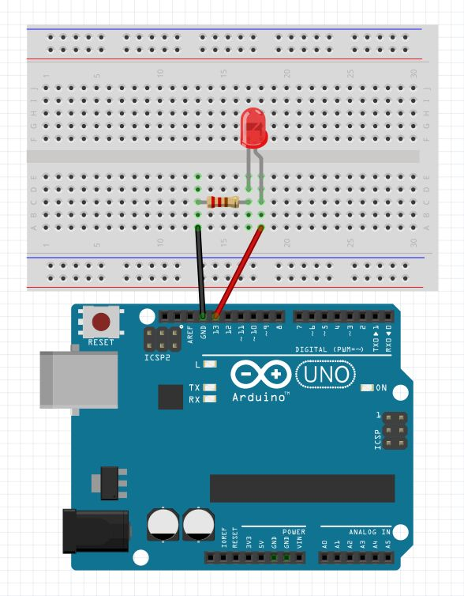

# Raspberry Pi

It's a micro-computer.

# Arduino

It's a micro-controller.

Diagrams can be made with the tool **Fritzing**.

## Setup

We can select the type of board we are working with at tools > board, or add ones with the boards manager.

We define the way we are connecting to the board via a port at tools > port. It changes each time the board is disconnected.

## Programming

The programming language is C/C++.

```c
void setup() {
  // put your setup code here, to run once:
}

void loop() {
  // put your main code here, to run repeatedly:
}
```

## Upload

The code is compiled and uploaded into the chip via the USB cable. The built-in small LED light will blink in the frequency of the loop to indicate that it's working.

## Serial Monitor

We can see what Arduino outputs via tools > serial monitor. If we are getting weird characters, we need to set the **baud** value to the correct one.

**baud** - Data rate in bits per second for serial data transmission.

## digitalWrite vs analogWrite

`digitalWrite` will set the specified pin to one of two states - HIGH/LOW, which equate to 5v (3.3v on some boards) and ground respectively.

`analogWrite` can vary by the type of output used. It will set the pin to a periodic high/low signal, where the percentage of the signal spent high is proportional to the value written. Ex. `analogWrite(PIN,255)`.

pinMode(buzzerPin, OUTPUT);

## Simple blinking LED example

```c
int LED = 12;

void setup() {
  pinMode(LED, OUTPUT);
}

void loop() {
  digitalWrite(LED, HIGH);
  delay(100);
  digitalWrite(LED, LOW);
  delay(100);
}
```



## Cop Car

```c
int LED_RED = 12;
int LED_BLUE = 13;
int BUZZER = 10;

void setup() {
  pinMode(LED_RED, OUTPUT);
  pinMode(LED_BLUE, OUTPUT);
  pinMode(BUZZER, OUTPUT);
}

void loop() {
  tone(BUZZER, 200, 250);
  digitalWrite(LED_RED, HIGH);
  delay(500);
  digitalWrite(LED_RED, LOW);

  tone(BUZZER, 400, 250);
  digitalWrite(LED_BLUE, HIGH);
  delay(500);
  digitalWrite(LED_BLUE, LOW);
}
```

# ESP28266 / NodeMCU

The esp8266 is a chip, it usually sits on a board.

The chip itself uses 3.3v, but if the board has a usb port, then it knows that usb comes with a 5v supply, so it probably has a regulator built-in to convert the 5v to the 3.3v the chip needs.

A phone charger or power bank should work just fine.

https://tttapa.github.io/ESP8266/Chap04%20-%20Microcontroller.html

While the ESP8266 is often used as a ‘dumb’ Serial-to-WiFi bridge, it’s a very powerful microcontroller on its own.

## Setup

1. Start Arduino IDE and open Preferences window.

2. Enter http://arduino.esp8266.com/stable/package_esp8266com_index.json into Additional Board Manager URLs field. You can add multiple URLs, separating them with commas.

3. Open Boards Manager from Tools > Board menu and install esp8266 platform (and don't forget to select your ESP8266 board from Tools > Board menu after installation).

## LED example

```c
int LED = D7;

void setup() {
  pinMode(LED, OUTPUT);
}

void loop() {
  digitalWrite(LED, LOW);
  delay(1000);
  digitalWrite(LED, HIGH);
  delay(2000);
}
```

## Remote LED light

Upload the code into NodeMCU, and go to the local address specified in the serial monitor in order to toggle the LED light, connected in a classic GPIO way.

```c
#include <ESP8266WiFi.h>

const char* ssid = "WIFI_NAME";
const char* password = "WIFI_PASSWORD";

int ledPin = 13; // GPIO13---D7 of NodeMCU
WiFiServer server(80);

void setup() {
  Serial.begin(115200);
  delay(10);

  pinMode(ledPin, OUTPUT);
  digitalWrite(ledPin, LOW);

  // Connect to WiFi network
  Serial.println();
  Serial.println();
  Serial.print("Connecting to ");
  Serial.println(ssid);

  WiFi.begin(ssid, password);

  while (WiFi.status() != WL_CONNECTED) {
    delay(500);
    Serial.print(".");
  }
  Serial.println("");
  Serial.println("WiFi connected");

  // Start the server
  server.begin();
  Serial.println("Server started");

  // Print the IP address
  Serial.print("Use this URL to connect: ");
  Serial.print("http://");
  Serial.print(WiFi.localIP());
  Serial.println("/");

}

void loop() {
  // Check if a client has connected
  WiFiClient client = server.available();
  if (!client) {
    return;
  }

  // Wait until the client sends some data
  Serial.println("new client");
  while(!client.available()){
    delay(1);
  }

  // Read the first line of the request
  String request = client.readStringUntil('\r');
  Serial.println(request);
  client.flush();

  // Match the request

  int value = LOW;
  if (request.indexOf("/LED=ON") != -1)  {
    digitalWrite(ledPin, HIGH);
    value = HIGH;
  }
  if (request.indexOf("/LED=OFF") != -1)  {
    digitalWrite(ledPin, LOW);
    value = LOW;
  }

// Set ledPin according to the request
//digitalWrite(ledPin, value);

  // Return the response
  client.println("HTTP/1.1 200 OK");
  client.println("Content-Type: text/html");
  client.println(""); //  do not forget this one
  client.println("<!DOCTYPE HTML>");
  client.println("<html>");

  client.print("Led is now: ");

  if(value == HIGH) {
    client.print("On");
  } else {
    client.print("Off");
  }
  client.println("<br><br>");
  client.println("<a href=\"/LED=ON\"\"><button>On </button></a>");
  client.println("<a href=\"/LED=OFF\"\"><button>Off </button></a><br />");
  client.println("</html>");

  delay(1);
  Serial.println("Client disonnected");
  Serial.println("");
}
```
