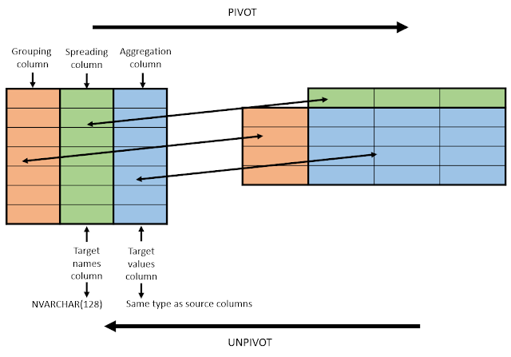

# Partition By

We use this to make a "sub-query" i.e. select n-th item from a table for further use.

### Data

``` sql
SELECT 
    clientID,
    invoiceDate,
    revenue
FROM sales
```

| clientID | invoiceDate | revenue |
|---|---|---|
1017 | 2019-01-31 | 6574.65
116  | 2018-02-05 | 5593.22
1211 | 2018-01-15 | 3637.80
116  | 2018-02-16 | 1848.00
1211 | 2018-01-09 | 15615.65
1017 | 2019-02-14 | 1386.00
1211 | 2018-02-09 | 16145.72
116  | 2018-02-13 | 2784.51
1211 | 2018-03-28 | 8844.64


### Data with PARTITION BY

In this case, we want to have the latest sale for each client. We can achieve this by partitioning the data i.e. ordering the sales for each client in descending order based on the date. We can then select only the desired row with `rowNumber`.

``` sql
SELECT 
    ROW_NUMBER() OVER (PARTITION BY clientID ORDER BY invoiceDate DESC) rowNumber,
    clientID,
    invoiceDate,
    revenue
FROM sales
```

| rowNumber | clientID | invoiceDate | revenue |
|---|---|---|---|
1 | 1017 | 2019-02-14 | 1386.00
2 | 1017 | 2019-01-31 | 6574.65
1 | 116  | 2018-02-16 | 1848.00
2 | 116  | 2018-02-13 | 2784.51
3 | 116  | 2018-02-05 | 5593.22
1 | 1211 | 2018-03-28 | 8844.64
2 | 1211 | 2018-02-09 | 16145.72
3 | 1211 | 2018-01-15 | 3637.80
4 | 1211 | 2018-01-09 | 15615.65

### Result

```sql
SELECT 
    lastSale.clientID, 
    lastSale.invoiceDate, 
    lastSale.revenue
FROM (
    SELECT 
        ROW_NUMBER() OVER (PARTITION BY clientID ORDER BY invoiceDate DESC) rowNumber,
        clientID,
        invoiceDate,
        revenue
    FROM sales
) lastSale
WHERE lastSale.rowNumber = 1
```

We only get the first row for each client i.e. the last sale (sorted by descending invoice date).

|acReceiver | adDate | sales|
|---|---|---|
1017 | 2019-02-14 | 1386.00
116  | 2018-02-16 | 1848.00
1211 | 2018-03-28 | 8844.64

# Pivot

In order for the pivoting to work, we must **only use the columns needed**, instead of all of them. This results in repeating rows.


### Data
Here is some example data, obtained by the given query.

| product | yearSold | revenue |
|---|---|---|
shoes | 2018 | 33924978.2497
shirts | 2018 | 34362105.196
hats | 2018 | 25119529.9395
shoes | 2019 | 6947797.012
shirts | 2019 | 8070039.2266
hats | 2019 | 5780623.5762

```sql
SELECT
    product,
    yearSold,
    revenue
FROM sales
GROUP BY
    yearSold,
    product
```

### Approach 1 (FROM)



```sql
SELECT 
    product,  -- grouping column
    [2019],   -- spreading value 1
    [2018]    -- spreading value 2
FROM (
    SELECT
        product,      -- grouping column
        yearSold,     -- spreading column
        revenue       -- aggregation column
    FROM sales
    GROUP BY
        yearSold,
        product
) PivotData
    PIVOT ( 
        SUM(revenue)   -- aggregation function (aggregation column)
        FOR yearSold   -- spreading column
        IN (
            [2019],    -- spreading value 1
            [2018])    -- spreading value 2
        ) piv
```

| product | 2019 | 2018|
|---|---|---|
shoes | 694 | 3392
shirts | 807 | 3436
hats | 578 | 2511

### Approach 2 (WITH)

```sql
WITH PivotData AS (
    SELECT
        product,
        yearSold,
        revenue
    FROM sales
    GROUP BY
        yearSold,
        product
) 
SELECT product, [2019], [2018]
FROM PivotData
    PIVOT ( SUM(revenue) FOR [year] IN ([2019], [2018]) ) piv
```